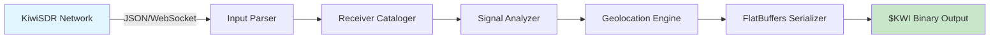
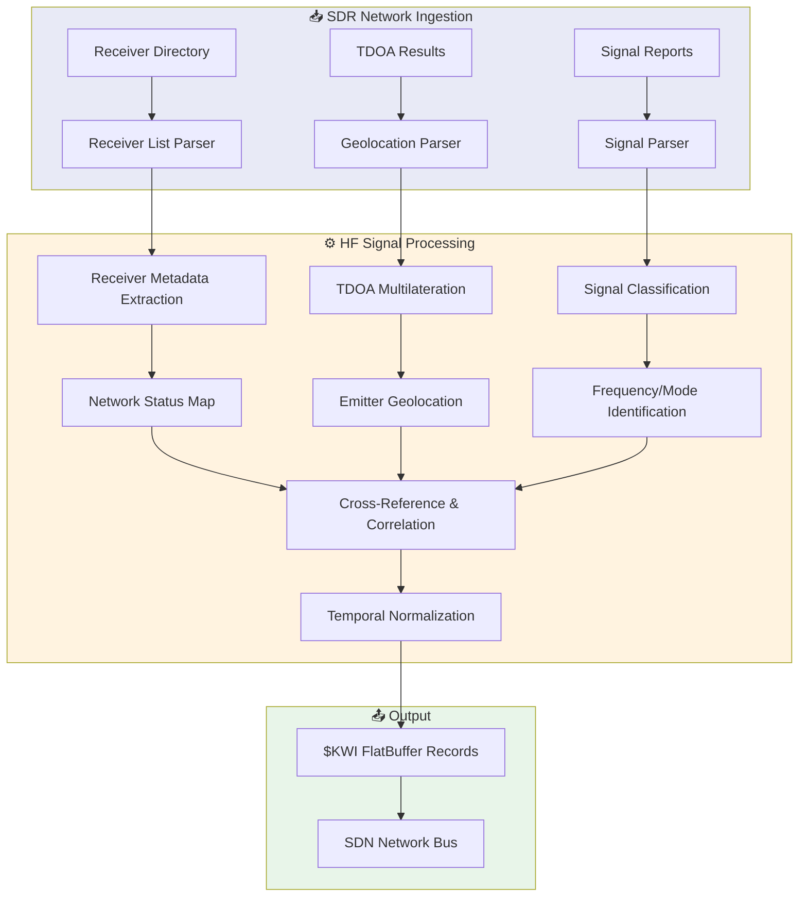
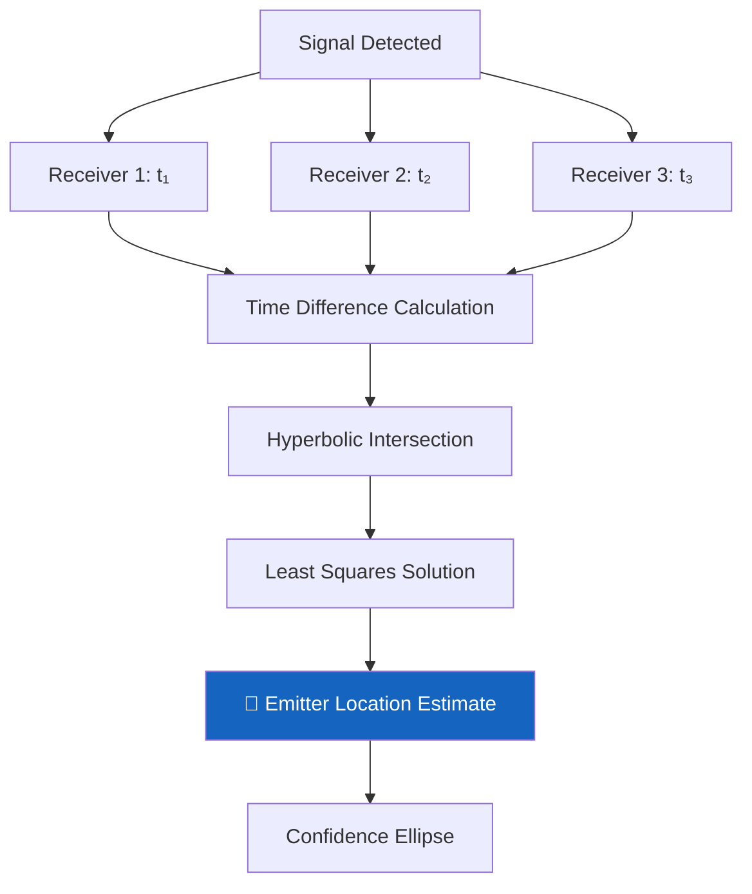

<](https://github.com/the-lobsternaut/kiwisdr-sdn-plugin/actions)
[](LICENSE)
[](https://github.com/the-lobsternaut/space-data-network)
[](#output-format)

**KiwiSDR Global HF Radio Receiver Network** — a worldwide network of software-defined radio receivers monitoring the 0-30 MHz HF spectrum, compiled to WebAssembly for edge deployment.

---

## Overview

KiwiSDR is a global network of over 600 software-defined radio (SDR) receivers deployed by volunteers worldwide, covering the 0-30 MHz High Frequency (HF) band. Each KiwiSDR is a web-accessible receiver that allows remote users to tune and listen to HF signals. The network provides unprecedented global coverage of the HF spectrum, enabling monitoring of shortwave broadcasts, amateur radio, aviation, maritime, military, and over-the-horizon radar signals. This plugin ingests KiwiSDR receiver metadata and signal data and converts it to FlatBuffers-aligned binary format.

### Why It Matters

- **Ionospheric monitoring**: HF propagation directly reflects ionospheric conditions, which affect satellite communications and GPS accuracy
- **GPS/GNSS jamming detection**: HF spectrum analysis can identify interference patterns that correlate with GNSS disruption
- **Over-the-horizon radar (OTHR)**: Detect and geolocate OTHR signals (e.g., Russian Duga, Chinese systems) that indicate military posture
- **Space weather ground truth**: HF blackouts caused by solar flares provide real-time indicators of space weather severity
- **Geolocation intelligence**: Network of distributed receivers enables signal geolocation via time-difference-of-arrival (TDOA)

---

## Architecture



### Data Flow



### TDOA Geolocation



---

## Data Sources & APIs

| Source | URL | Description |
|--------|-----|-------------|
| **KiwiSDR Directory** | http://rx.linkfanel.net/ | Global receiver directory and status |
| **KiwiSDR Map** | http://map.kiwisdr.com/ | Interactive receiver map |
| **KiwiSDR Project** | http://kiwisdr.com/ | Hardware and software project page |
| **KiwiSDR TDOA** | http://kiwisdr.com/ks/ks.html | TDOA geolocation service |
| **KiwiSDR Forum** | https://forum.kiwisdr.com/ | Community forum |

---

## HF Band Allocations (Space-Relevant)

| Frequency Range | Allocation | Relevance |
|----------------|-----------|-----------|
| **2.850 – 3.025 MHz** | Aeronautical Mobile (HF) | Aircraft tracking |
| **4.750 – 4.995 MHz** | Fixed, Mobile | Military HFGCS |
| **5.680 – 5.730 MHz** | Aeronautical Mobile (OR) | Search and rescue |
| **8.100 – 8.195 MHz** | Maritime Mobile | Ship tracking |
| **8.815 – 8.965 MHz** | Aeronautical Mobile (R) | Oceanic air traffic |
| **10.003 – 10.005 MHz** | Standard Frequency | Time signal (WWV) |
| **11.175 MHz** | USAF HFGCS | Military emergency action |
| **14.000 – 14.350 MHz** | Amateur | Propagation indicators |
| **21.000 – 21.450 MHz** | Amateur | Solar cycle indicators |
| **25.010 – 25.070 MHz** | Standard Frequency | Time signal (WWV25) |

---

## Research & References

- Kok, M. (2018). ["KiwiSDR: Wide-band, GPS-equipped, SDR Receiver"](http://kiwisdr.com/). KiwiSDR Project Documentation.
- ITU (2024). ["Radio Regulations"](https://www.itu.int/pub/R-REG-RR). International Telecommunication Union.
- Hargreaves, J. K. (1992). ["The Solar-Terrestrial Environment"](https://doi.org/10.1017/CBO9780511628924). Cambridge University Press.
- Davies, K. (1990). ["Ionospheric Radio"](https://digital.library.unt.edu/ark:/67531/metadc40561/). Peter Peregrinus Ltd.
- TDOA Multilateration: ["Hyperbolic Navigation"](https://en.wikipedia.org/wiki/Multilateration). Intersection of hyperbolic curves for position estimation.

---

## Technical Details

### KiwiSDR Hardware Specifications

| Parameter | Value |
|-----------|-------|
| **Frequency Range** | 10 kHz – 30 MHz |
| **Bandwidth** | 30 MHz (full HF band) |
| **ADC** | 14-bit, 66.67 MSPS |
| **GPS** | Built-in GPS for timing/location |
| **Simultaneous Users** | 4-8 (depends on bandwidth) |
| **Platform** | BeagleBone with custom RF cape |

### Signal Classification

| Mode | Description | Example Signals |
|------|-------------|----------------|
| **AM** | Amplitude Modulation | Shortwave broadcasts |
| **SSB** | Single Sideband | Amateur radio, maritime |
| **CW** | Continuous Wave (Morse) | Amateur, military beacons |
| **STANAG** | NATO standard modes | Military data links |
| **ALE** | Automatic Link Establishment | Military/commercial HF |
| **OTHR** | Over-the-horizon radar | Duga, Jindalee, etc. |
| **FT8/FT4** | Digital amateur modes | Propagation monitoring |

### Ionospheric Propagation & Space Weather

| HF Condition | Cause | Space Impact |
|-------------|-------|-------------|
| **HF Blackout** | Solar X-ray flare (M/X class) | Indicates satellite radiation risk |
| **Enhanced propagation** | Solar F10.7 index increase | Indicates rising solar activity |
| **Polar Cap Absorption** | Solar proton event | Affects polar-orbit satellites |
| **Sporadic-E** | Atmospheric dynamics | Communications anomalies |

### Processing Pipeline

1. **JSON Ingestion** — Parse KiwiSDR directory and TDOA data
2. **Receiver Cataloging** — Index receivers by location, status, and capabilities
3. **Signal Analysis** — Classify detected signals by mode and frequency
4. **TDOA Geolocation** — Compute emitter positions from time-difference data
5. **Space Weather Correlation** — Link HF conditions to solar activity
6. **FlatBuffers Serialization** — Pack into `$KWI` aligned binary records

---

## Input/Output Format

### Input

JSON from KiwiSDR receiver directory:

```json
{
  "url": "http://kiwisdr.example.com:8073",
  "name": "KiwiSDR - London",
  "gps": "51.5074,-0.1278",
  "users": 3,
  "users_max": 8,
  "antenna": "Mini Whip",
  "bands": "0-30 MHz",
  "snr": 24,
  "offline": false
}
```

### Output

`$KWI` FlatBuffer-aligned binary records:

| Field | Type | Description |
|-------|------|-------------|
| `timestamp` | `float64` | Unix epoch seconds of status check |
| `latitude` | `float64` | Receiver WGS84 latitude |
| `longitude` | `float64` | Receiver WGS84 longitude |
| `value` | `float64` | SNR (dB) or user count |
| `source_id` | `string` | Receiver URL/name |
| `category` | `string` | Receiver status / signal type |
| `description` | `string` | Antenna, bands, and status info |

**File Identifier:** `$KWI`

---

## Build Instructions

### Quick Build

```bash
cd plugins/kiwisdr
./build.sh
```

### Manual Build

```bash
cd plugins/kiwisdr
git submodule update --init deps/emsdk
cd deps/emsdk && ./emsdk install latest && ./emsdk activate latest && cd ../..
source deps/emsdk/emsdk_env.sh
cd src/cpp && emcmake cmake -B build -S . && emmake make -C build
```

### Run Tests

```bash
cd src/cpp
cmake -B build -S . && cmake --build build && ctest --test-dir build
```

---

## Usage Examples

### Node.js

```javascript
import { SDNPlugin } from '@the-lobsternaut/sdn-plugin-sdk';

const plugin = await SDNPlugin.load('./wasm/node/kiwisdr.wasm');

// Fetch KiwiSDR receiver directory
const receivers = await fetch('http://rx.linkfanel.net/rx_list.json');
const result = plugin.parse(await receivers.text());
console.log(`Cataloged ${result.records} HF receivers worldwide`);
```

### C++ (Direct)

```cpp
#include "kiwisdr/types.h"

auto dataset = kiwisdr::parse_json(json_input);
for (const auto& rx : dataset.records) {
    printf("📻 %s at (%.4f, %.4f) — SNR: %.0f dB — %s\n",
           rx.source_id.c_str(), rx.latitude, rx.longitude,
           rx.value, rx.category.c_str());
}
```

---

## Dependencies

| Dependency | Version | Purpose |
|-----------|---------|---------|
| **Emscripten (emsdk)** | latest | C++ → WASM compilation |
| **CMake** | ≥ 3.14 | Build system |
| **FlatBuffers** | ≥ 23.5 | Binary serialization |
| **C++17** | — | Language standard |

---

## Plugin Manifest

```json
{
  "schemaVersion": 1,
  "name": "kiwisdr",
  "version": "0.1.0",
  "description": "KiwiSDR global HF radio receiver network. Parses SDR receiver data and signal monitoring",
  "author": "DigitalArsenal",
  "license": "Apache-2.0",
  "inputFormats": ["application/json"],
  "outputFormats": ["$KWI"],
  "dataSources": [
    {
      "name": "kiwisdr",
      "url": "http://rx.linkfanel.net/",
      "type": "REST",
      "auth": "api_key (optional)"
    }
  ]
}
```

---

## Project Structure

```
plugins/kiwisdr/
├── README.md
├── build.sh
├── plugin-manifest.json
├── deps/
│   └── emsdk/
├── src/cpp/
│   ├── CMakeLists.txt
│   ├── include/kiwisdr/
│   │   └── types.h
│   ├── src/
│   │   └── kiwisdr.cpp
│   ├── tests/
│   │   └── test_kiwisdr.cpp
│   └── wasm_api.cpp
└── wasm/
    └── node/
```

---

## License

This project is licensed under the [Apache License 2.0](https://www.apache.org/licenses/LICENSE-2.0).

---

## Related Plugins

- [`nws`](../nws/) — NOAA National Weather Service alerts
- [`safecast`](../safecast/) — Citizen-science radiation monitoring
- [`radnet`](../radnet/) — EPA RadNet radiation monitoring

---

*Part of the [Space Data Network](https://github.com/the-lobsternaut/space-data-network) plugin ecosystem.*
]]>